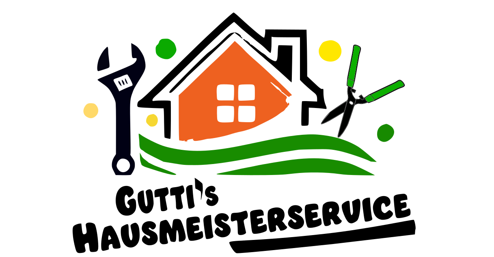
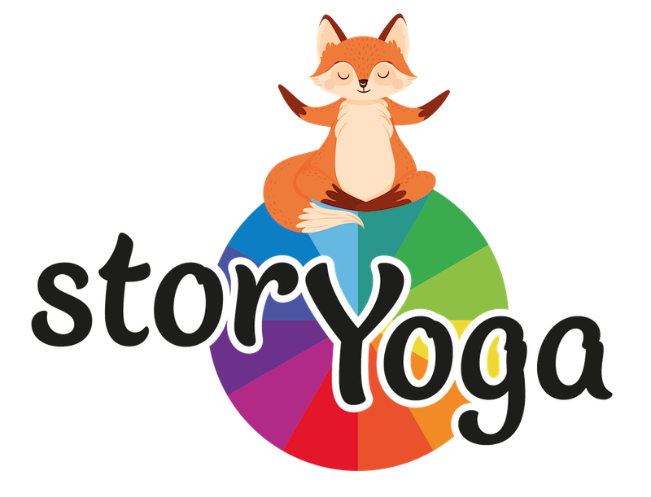

# 🚀 Navigation

[GitHub WEBSITE](https://123matthias.github.io/123Matthias/)

[GitHub Account](https://github.com/123Matthias)

[✉️ Contact me here](#contact)

# Hallo!
Hier sind ein paar meiner Projekte gelisted an denen ich arbeite. Meine Skills im Bereich Programmierung, Softwareentwicklung und technischen Anwendungen findet man ganz unten. 

# Projekte

## OSWalk (PC search Engine)
- Linux MacOSX Windows Suchmaschine
- Volltextsuche nach keywords in Dokumenten
- Suche nach Dateiname und Inhalt
- Pfad einstellbar
- PDF-durchsuchen
- Terminal - print() wird in Console in GUI übergeben
- verschiedene Dateiformate erkennbar und erweiterbar

zum Testen main.py in IDE (bspw. VSCode) starten

[Repository OSWalk](https://github.com/123Matthias/OSWalk)

## AutoCAD Library
- Werkzeugpaletten
- dynamische Blöcke
- AutoCAD, AutoCAD LT
- Installationsvideos

[Website AutoCAD Library](https://123matthias.github.io/ACAD-Library)
 
[AutoCAD Repository](https://github.com/123Matthias/ACAD-Library)  

## Guttis &nbsp;  &nbsp; 
- Statische Website in HTML, CSS, JS  
- Bootstrap nur minimal zur Unterstützung  
- Fertiggestellt, über Cloudflare erreichbar  
- SEO-optimiert für Google, Bing, DuckDuckGo usw.

[Guttis Repository](https://github.com/123Matthias/Guttis)  

## BackupTool &nbsp;  &nbsp; 
- Java-Backup-Programm, in Bearbeitung Stand ca. 60% (Merge- und Full-Backup)  
- Multithreading & dynamisches Speicher-Buffering  
- AES-Verschlüsselung (mehrere Methoden)  
- GUI mit FXML  
- Backup-Planung: minütlich, täglich, bestimmtes Datum  
- Testbar mit IntelliJ & Maven

[BackupTool Repository](https://github.com/123Matthias/BackupTool)

## storYoga &nbsp;  &nbsp; 
- **Server & Infrastruktur:** Linux VPS, Cloudflare Reverse Proxy mit Turnstile
- **Sicherheit:** Admin Area mit MFA-Login, Schutz vor SQL Injection, Session-Fixation und CSRF, sichere Header und Session-ID-Regeneration ...
- **Backend & API:** REST API, Apache, PostgreSQL
- **Architektur & Tech:** Eigenes MVC-Pattern, kein CMS oder Framework, Backend in PHP, Frontend in JS, HTML und CSS (Bootstrap 5)

Website erreichbar unter https://storyoga.at

## Skills
- Websites in html, css und JS
- Frameworks können erlernt und verwendet werden (Angular etc.)
- SEO mit Google Search Console oder Bing Webmaster Tool
- Java-Software
- PHP, Python
- MacOSX, Linux, Windows
- Netzwerktechnik
- Scripts in bspw: Powershell ...

## Other Skills
- Maschinenbau, Stahlbau
- 3D-CAD
- AutoCAD

  <h2 id="contactText">✉️ Contact</h2>
  <address class="address">
    
Matthias Leiter

    <a href="mailto:matthias-github@gmx.at">matthias-github@gmx.at</a> 
    <a href="https://github.com/123Matthias/123Matthias/discussions/1" target="_blank" rel="noopener">GOTO GitHub Discussion</a> (for GitHub Developers)
  </address>

